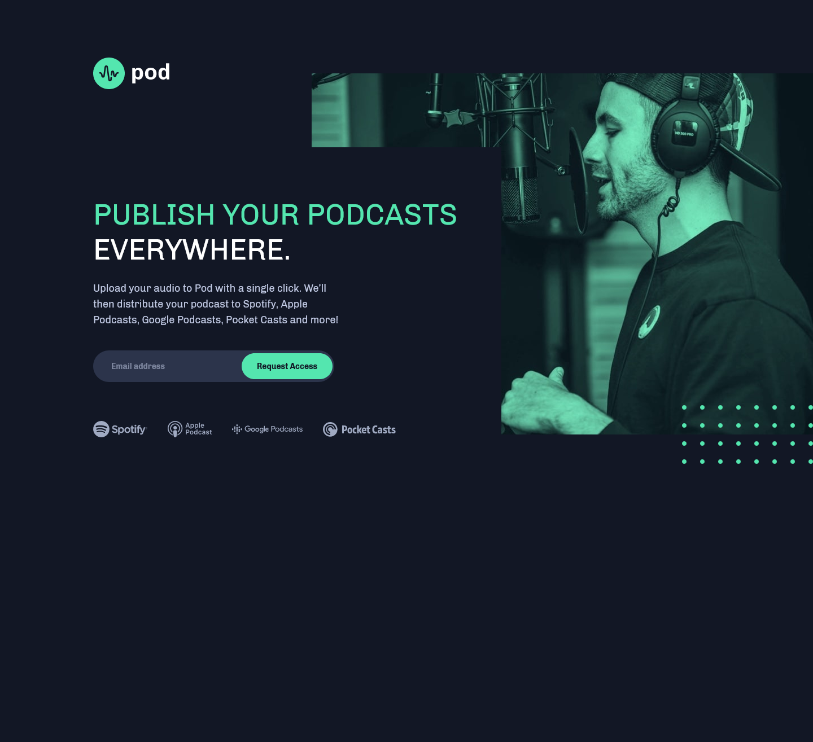

# Meet - Responsive Request Access Page

"Pod" is a hypothetical platform that distributes user generated podcasts on Spotify, Apple Podcasts, Google Podcasts, Pocket Casts, and more.

## Table of contents

- [Overview](#overview)
  - [The challenge](#the-challenge)
  - [Screenshot](#screenshot)
  - [Links](#links)
- [My process](#my-process)
  - [Built with](#built-with)
  - [What I learned](#what-i-learned)
  - [Continued development](#continued-development)

## Overview

### The challenge

Users should be able to:

- View the optimal layout depending on their device's screen size, including desktop, tablet, and mobile (e.g. responsive design)
- See hover states for interactive elements (e.g. buttons)
- Receive an error message when the email form is submitted incorrectly or a success message when submitted correctly.

### Screenshot

### Links

- Live Site URL: [https://ryanjsheehan1.github.io/pod-request/](https://ryanjsheehan1.github.io/meet/)

## My process

### Built with

- Semantic HTML5 markup
- CSS custom properties
- Flexbox
- Sass CSS Preprocessor
- JavaScript
- Desktop-first workflow

### What I learned

### Continued development
